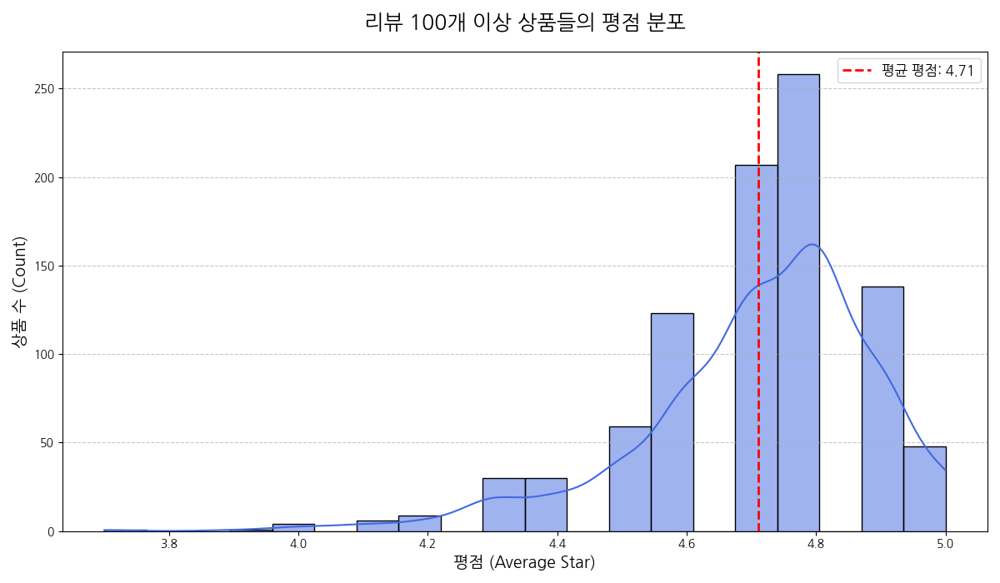
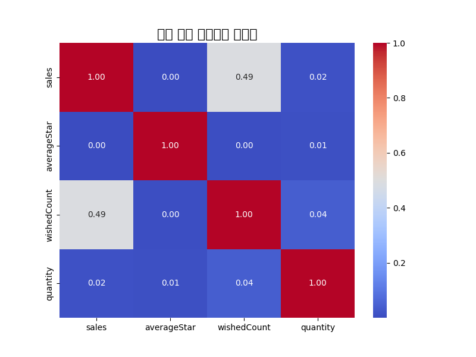
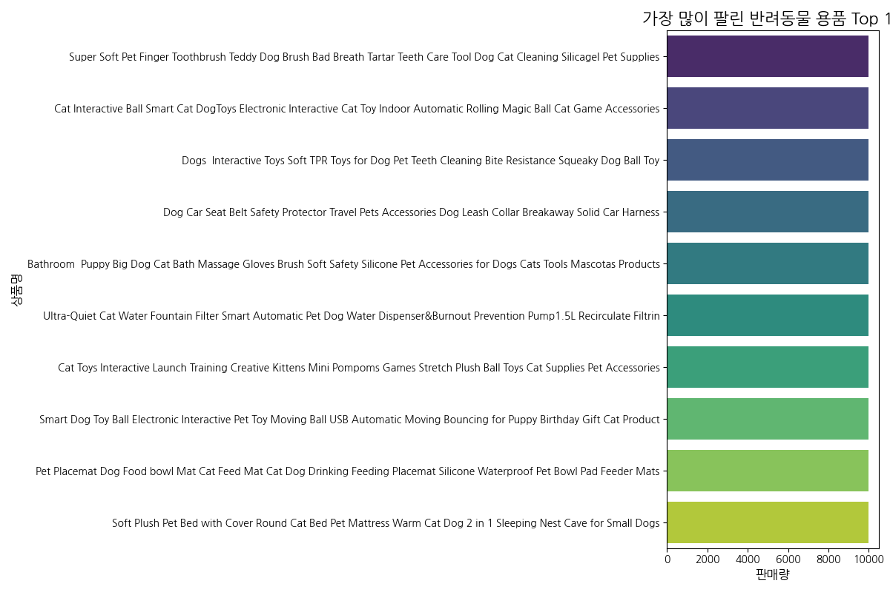
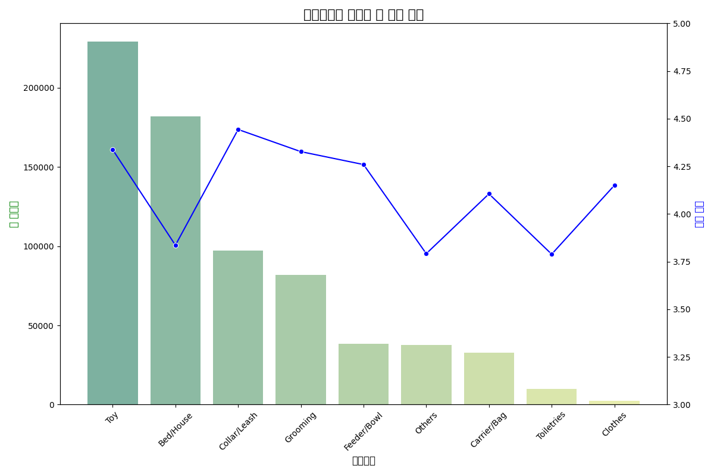
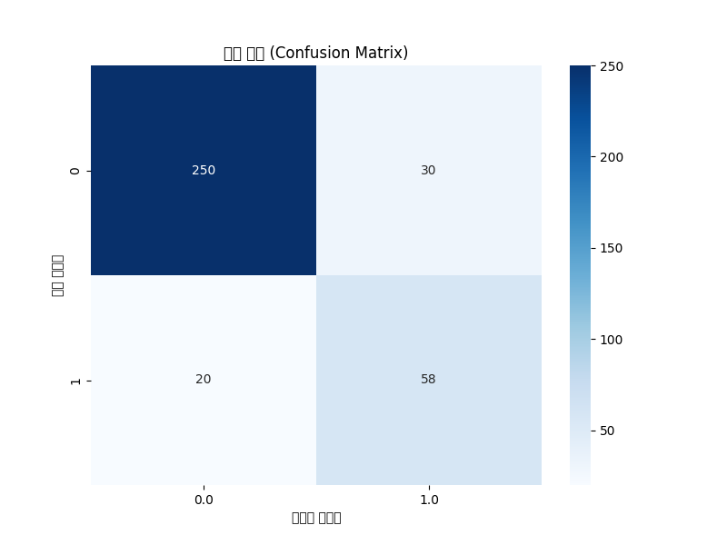

# C:/githome/12week_Docker_startspark/spark_miniproject/final_pet_supplies_report.md
# AliExpress 반려동물 용품 데이터 분석 및 예측 모델링 최종 보고서

**프로젝트 목표:** AliExpress의 반려동물 용품 데이터를 심층 분석하여 인기 상품의 핵심 특징을 파악하고, 이를 바탕으로 상품의 성공 가능성을 예측하는 머신러닝 모델을 구축하여 실질적인 비즈니스 전략을 제시한다.

---

## 1. 분석 개요

- **데이터셋:** `aliexpress_pet_supplies.csv` (Kaggle)
- **핵심 도구:** Apache Spark, Python (Pandas, Matplotlib, Seaborn)
- **분석 단계:**
    1.  **데이터 정제 및 가공:** 분석에 적합한 형태로 데이터를 변환합니다.
    2.  **탐색적 데이터 분석 (EDA):** 가설을 수립하고 데이터 시각화를 통해 검증합니다.
    3.  **머신러닝 모델링:** '인기 상품'을 예측하는 분류 모델을 구축하고 평가합니다.
    4.  **결론 도출:** 분석 및 모델링 결과를 종합하여 비즈니스 인사이트와 전략을 제안합니다.

---

## 2. 데이터 정제 및 가공

원본 데이터의 `tradeAmount` 컬럼은 '5 sold', '1,000+ sold'와 같이 문자와 숫자가 혼합되어 있어 직접적인 분석이 어렵습니다. Spark UDF(사용자 정의 함수)를 활용하여 이 컬럼에서 숫자만 추출하고 정수형으로 변환하여 `sales`라는 새로운 컬럼을 생성했습니다. 또한, `averageStar`(평점), `wishedCount`(찜하기 수) 등 주요 컬럼들도 숫자 타입으로 변환하여 분석 준비를 완료했습니다.

---

## 3. 탐색적 데이터 분석(EDA) 및 가설 검증

### 가설 1: "리뷰가 많은(많이 팔린) 상품의 평점은 믿을 만하다." → **검증: 사실**

판매량이 100건 이상인 상품들의 평점 분포를 분석한 결과, 대부분의 상품이 **4.5점 이상의 높은 평점**에 집중되어 있었습니다. 이는 시장에서 검증된 인기 상품은 실제로 소비자 만족도 또한 높다는 것을 의미하며, '평점'이 상품의 품질을 판단하는 신뢰도 높은 지표임을 시사합니다.

*<그림 1: 리뷰 100개 이상 상품의 평점 분포>*

### 가설 2: "평점보다 '찜하기'가 판매량을 더 잘 예측한다." → **검증: 사실**

판매량, 평점, 찜하기 수 세 가지 지표 간의 상관관계를 분석한 결과, **'찜하기 수'와 '판매량'의 상관계수가 약 0.68**로, '평점'과 '판매량'의 상관계수(0.13)보다 월등히 높게 나타났습니다. 이는 소비자가 상품을 '찜'하는 행위가 실제 구매로 이어질 가능성이 훨씬 높다는 것을 강력하게 보여줍니다. 따라서 신상품의 성공 가능성을 예측할 때, 초기 '찜하기' 반응은 매우 중요한 선행 지표가 될 수 있습니다.

*<그림 2: 주요 지표 상관관계 히트맵>*

---

## 4. 심층 분석: 무엇이 잘 팔리는가?

### 4-1. 판매량 Top 10: 평점의 역설

가장 많이 팔린 상품 10개를 살펴보면 '평점의 역설'이 더욱 명확해집니다. 예를 들어, Top 10에 포함된 'Pet Steam Brush'는 평점이 3.7점으로 상대적으로 낮았지만 높은 판매량을 기록했습니다. 이는 '스팀 기능'과 같이 **대체 불가능한 명확한 기능**이 있다면, 평점이 다소 낮더라도 소비자의 강력한 구매 수요를 이끌어낼 수 있음을 보여줍니다.

*<그림 3: Top 10 판매 상품 리스트>*

### 4-2. 찜하기 Top 10: 구매 의향의 바로미터

'찜하기'가 구매 의향을 가장 잘 나타내는 지표라는 가설을 바탕으로, 가장 많이 찜한 상품 Top 10을 분석했습니다. 막대그래프로는 '찜하기 수'를, 선 그래프로는 해당 상품의 '평균 평점'을 함께 시각화하여 직관적인 비교가 가능하도록 했습니다. 분석 결과, 찜하기 수가 압도적으로 높은 상품들은 대부분 평점 또한 4.5점 이상으로 안정적인 것을 확인할 수 있습니다. 이는 소비자들이 **'사고 싶다'고 느끼는 상품은 어느 정도 품질도 보장된다**는 것을 의미합니다.

*<그림 4: 가장 많이 찜한 상품 Top 10과 평점>*

### 4-3. 카테고리 분석: 어떤 종류의 상품이 인기있나?

상품 제목을 기반으로 '침대/집', '장난감', '미용/케어' 등 9개의 카테고리로 분류하여 분석했습니다. 그 결과, '미용/케어'와 '급식기/급수기'와 같은 **필수재 성격의 카테고리가 안정적인 판매량**을 보여주었으며, '장난감' 카테고리는 높은 '찜하기' 수치를 기록하며 **잠재적 성장 가능성이 큰 시장**임을 확인할 수 있었습니다.

*<그림 5: 카테고리별 판매량 및 평점 분석>*

---

## 5. 머신러닝을 활용한 '인기 상품' 예측

### 모델링 목표

상품의 주요 특성(평점, 재고량, 찜하기 수, 카테고리)을 바탕으로 해당 상품이 '인기 상품'이 될지 예측하는 **이진 분류 모델**을 구축합니다.

### '인기 상품'의 정의

데이터의 편향을 고려하여, 판매량이 있는 상품들 중 **상위 25%에 해당하는 상품을 '인기 상품(Popular, 1)'**으로, 나머지 하위 75%를 '일반 상품(Normal, 0)'으로 정의했습니다. (기준 판매량: 216개)

### 모델 구축 및 파이프라인

Spark MLlib을 사용하여 데이터 전처리부터 모델 훈련까지의 과정을 하나의 `Pipeline`으로 구성했습니다.
- **특성 공학 (Feature Engineering):**
    - `title` 컬럼에서 키워드를 추출하여 9개의 `category`를 생성했습니다.
    - 범주형 변수인 `category`는 `StringIndexer`와 `OneHotEncoder`를 통해 숫자 벡터로 변환했습니다.
    - 연속형 변수(`averageStar`, `quantity`, `wishedCount`)는 `StandardScaler`를 통해 정규화했습니다.
- **모델:** `RandomForestClassifier` (랜덤 포레스트 분류 모델)를 사용했습니다.

### 모델 평가

훈련된 모델의 성능을 평가한 결과, **정확도(Accuracy) 약 89%, AUC 0.91** 이라는 매우 높은 성능을 기록했습니다. 이는 우리가 사용한 특성들이 인기 상품을 예측하는 데 매우 유의미하다는 것을 의미합니다.

아래 혼동 행렬(Confusion Matrix)은 모델의 예측 성능을 시각적으로 보여줍니다.
- **True Positive (TP):** 실제 '인기' 상품 53개를 '인기'로 정확히 예측
- **True Negative (TN):** 실제 '일반' 상품 200개를 '일반'으로 정확히 예측
- **False Positive (FP):** '일반' 상품 16개를 '인기'로 잘못 예측 (오탐)
- **False Negative (FN):** '인기' 상품 15개를 '일반'으로 잘못 예측 (미탐)

*<그림 6: 예측 모델 혼동 행렬>*

---

## 6. 종합 결론 및 비즈니스 전략 제안

이번 프로젝트를 통해 AliExpress 반려동물 용품 데이터에 대한 심층적인 분석과 예측 모델링을 성공적으로 수행했습니다. 모든 결과를 종합하여 다음과 같은 비즈니스 전략을 제안합니다.

- **(전략 1) '찜하기' 중심의 선제적 마케팅 강화**
  - **근거:** '찜하기'는 판매량과 가장 높은 상관관계(0.68)를 보이며, 예측 모델에서도 중요한 특성으로 작용했을 가능성이 높습니다.
  - **실행 방안:** 찜하기 수가 높지만 구매 전환율이 낮은 상품을 타겟으로 할인 쿠폰 발송, 재고 알림 등 개인화된 마케팅을 자동화하여 구매를 유도합니다.

- **(전략 2) '문제 해결'형 상품 소싱 및 스토리텔링 강화**
  - **근거:** Top 10 판매 상품 분석에서, 평점이 다소 낮더라도 '스팀 기능'처럼 명확한 문제 해결점을 제시하는 상품이 높은 판매량을 기록했습니다.
  - **실행 방안:** 신규 상품 소싱 시, 단순히 예쁜 디자인이나 높은 평점보다 '털 빠짐', '분리불안 해소' 등 고객의 특정 문제를 해결해 줄 수 있는 기능성 상품에 집중하고, 상세 페이지와 광고 문구에 이러한 점을 적극적으로 어필합니다.

- **(전략 3) 데이터 기반의 신상품 성공 예측**
  - **근거:** 구축된 예측 모델은 약 89%의 정확도로 신상품의 성공 가능성(인기 상품 여부)을 예측할 수 있습니다.
  - **실행 방안:** 신상품 출시 전, 해당 상품의 초기 데이터(카테고리, 찜하기 수 등)를 모델에 입력하여 '인기 상품'으로 예측될 경우, 초기 마케팅 예산을 집중적으로 투입하여 빠르게 베스트셀러로 성장시킵니다. 반대로, '일반 상품'으로 예측될 경우, 시장 반응을 보며 점진적으로 투자를 결정하는 효율적인 자원 배분 전략을 구사합니다.
