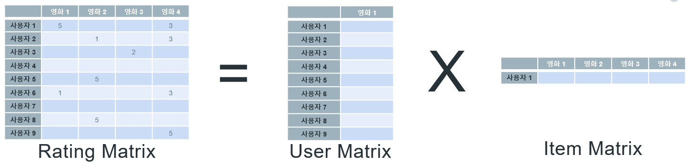
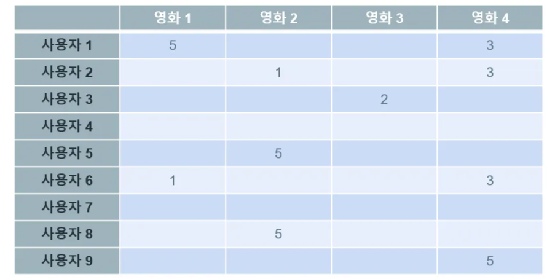
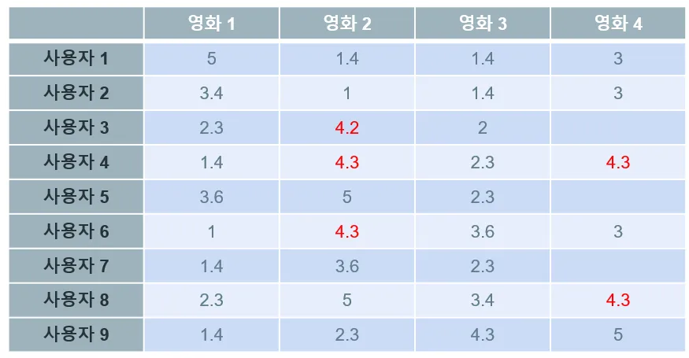

# MLlib-ALS 기반 협업필터링시스템 (1)

생성 일시: 2025년 8월 6일 오전 9:12

# ALS 알고리즘

ALS(Alternating Least Squares)는 행렬 분해(Matrix Factorization) 기반의 협업 필터링 알고리즘이다.

<aside>
💡

ALS는 실제 평점 행렬(R)과 가장 비슷하게 되도록 두 개의 **잠재 요인 행렬(Latent Factor Matrices)**을 **분해하고 다시 곱**해서 예측하는 방식

</aside>

사용자-아이템 평점 행렬을 두 개의 저차원 행렬(사용자 잠재 요인과 아이템 잠재 요인)로 분해한다. 이 알고리즘은 두 행렬을 번갈아가며 최적화하는 방식으로 작동한다.

- ALS 알고리즘
    
    실제 계산에서는 특정 차원(latent factors)의 행렬로 변환하여 계산한다. 
    
    예를 들어 m×n 크기의 Rating Matrix는 m×k 크기의 User Matrix와 k×n 크기의 Item Matrix로 분해된다. 여기서 k는 모델의 복잡성을 결정하는 하이퍼파라미터이다.
    
    이때 반복을 통해 최적화가 진행될수록 예측값과 실제값 사이의 오차는 점점 줄어들게 된다. 즉, 잠재 요인 행렬들은 실제 평점 데이터를 더 잘 표현할 수 있게 된다. 학습이 완료된 후에는 기존에 평가하지 않은 항목에 대한 예측이 가능해진다.
    
    결과적으로 User Matrix와 Item Matrix의 곱으로 Rating Matrix와 최대한 가까운 Matrix가 생성되며, 이 Matrix는 빈 칸에 있는 값들이 모두 채워진 형태이다.
    
    이는 특정 사용자의 영화 목록 또는 특정 영화를 선택한 사용자 목록을 행렬곱하여 Rating Matrix를 만드는 방식으로, 열벡터와 행벡터의 행렬곱으로 완성된다.
    
- ALS의 작동 원리
    
    1.**초기화**: 사용자 행렬(U)와 아이템 행렬(I)을 무작위 값으로 초기화합니다. 이 두 행렬의 곱은 원래의 평가 행렬을 근사하게 됩니다.
    
    2.**교대 최소 제곱법**: ALS는 교대로 한 행렬을 고정시키고 다른 행렬을 최적화하는 방식으로 작동합니다. 예를 들어, 사용자 행렬을 고정시킨 상태에서 아이템 행렬을 최적화하고, 이후 아이템 행렬을 고정시킨 상태에서 사용자 행렬을 최적화합니다. 이 과정은 평가 행렬과 사용자 행렬 및 아이템 행렬의 곱 사이의 차이(오차)를 최소화합니다.
    
    3.**정규화**: 과적합(overfitting)을 방지하기 위해 정규화 항을 추가할 수 있습니다. 이는 모델이 훈련 데이터에 너무 정확히 맞춰지는 것을 방지하여, 일반화 성능을 향상시킵니다.
    
    4.**반복**: 위의 과정을 반복하여, 모델의 예측 성능이 더 이상 개선되지 않을 때까지 진행합니다.
    
    - 사용자 행렬과 아이템 행렬의 최적화가 완료되면, 이 두 행렬의 곱을 사용하여 비어 있는 평점들을 예측합니다. 이 곱셈 결과는 완성된 평점 행렬로, 모든 사용자와 모든 아이템 간의 평점 예측 값을 포함합니다.
    - 이 예측 행렬을 바탕으로 사용자별로 가장 높은 평점을 받을 것으로 예측되는 아이템을 추천합니다.
    
    
    
    1. User Matrix의 값과 Item Matrix의 값은 랜덤하게 채워집니다.
    2. Item 행렬을 고정 시키고 User 행렬을 최적화 합니다.
    3. User Matrix의 값과 Item Matrix의 값을 곱했을 때 Rating Matrix에 있는 값과 비슷하게 최적화가 됩니다.
    4. User 행렬을 고정 시키고 Item 행렬을 최적화 합니다.
    

ALS는 넷플릭스나 아마존 같은 대형 온라인 서비스에서 개인화된 추천을 제공하는 강력한 도구이다. 이 알고리즘은 사용자의 과거 행동 패턴을 분석하여 사용자가 좋아할 만한 영화나 TV 프로그램을 정확하게 예측하거나, 개인의 쇼핑 선호도와 구매 이력에 기반하여 가장 적합한 제품을 추천하는 데 폭넓게 활용된다.

대규모 사용자 데이터베이스에서도 효율적으로 작동하며, 실시간으로 개인화된 추천을 생성할 수 있는 능력 덕분에 현대 전자상거래 및 스트리밍 플랫폼에서 필수적인 요소로 쓰이고  있다.

# Spark MLlib의 ALS(Alternating Least Squares)

**`pyspark.ml.recommendation.ALS`** 클래스로 ALS를 구현하고 있다.  

스파크의 이 클래스는 대용량 데이터에서도 확장성이 뛰어나 실시간 추천 시스템에 적합하다.

<aside>
💡

MLlib의 ALS (Alaternating Least Squares) 알고리즘 기반 구현

</aside>

ALS는 사용자-아이템 행렬의 누락된 값을 예측해 아직 평가되지 않은 아이템에 대한 사용자 선호도를 추정한다. 이 방식은 특히 대규모 데이터셋에서 Spark의 분산 컴퓨팅 능력을 활용해 높은 성능을 보인다.

# 추천 알고리즘의 주요 유형

추천 시스템의 주요 유형은 크게 협업 필터링과 콘텐츠 기반 필터링이다.

## 협업 필터링

협업필터링은 사용자들의 기호(taste) 정보를 기반으로 관심사를 자동으로 예측하는 방식이다. 비슷한 취향을 가진 사용자들에게 서로 아직 구매하지 않은 상품을 교차 추천하거나, 사용자의 취향과 생활 패턴에 맞는 상품을 추천하는 서비스에 활용된다.

- 사용자와 아이템 간의 **과거 상호작용(평점, 클릭 등)**만 사용
- **아이템의 내용 정보 필요 없음**

<aside>
💡

“**비슷한 사용자나 아이템의 행동을 이용해서 추천**하는 방식”

</aside>

| 방법 | 설명 | 대표 알고리즘 |
| --- | --- | --- |
| **메모리 기반** | 유사 사용자/아이템 찾아서 직접 추천 | User-based, Item-based CF |
| **모델 기반** | 행렬 분해 등 수학 모델로 예측 | ✅ **ALS**, SVD, NMF |

## 협업필터링의 작동 원리

- 사용자 A는 일부 데이터만 있고, 사용자 B는 더 많은 데이터가 있다. 그러나 두 사용자의 영화 평가 패턴이 유사하다.
- A와 B가 동일한 영화에 비슷한 평점을 준다면, 두 사람의 영화 취향은 유사하다고 볼 수 있다. 따라서 B가 '위쳐'에 높은 평점을 주었다면, A에게도 '위쳐'를 추천하는 것이 협업 필터링의 기본 원리이다.


실제 데이터에서는 영화와 사용자 수가 매우 많다.

- 아래 표와 같이 빈 칸이 많은 것은 한 사용자가 모든 영화를 볼 수 없기 때문이다. 추천 시스템은 이러한 미시청 영화의 예상 평점을 예측하는 것이다.
- 예측된 평점을 높은 순으로 정렬하여 사용자에게 제공하는 것이 추천 시스템의 기본 원리이다.





### **콘텐츠 기반 필터링 (Content-Based Filtering)**

콘텐츠 기반 필터링은 사용자가 과거에 좋아했거나 관심을 보인 아이템의 특성을 분석하여 유사한 특성을 가진 다른 아이템을 추천하는 방식이다. 이 방법은 아이템 자체의 속성(예: 영화 장르, 배우, 감독, 줄거리 등)을 기반으로 추천을 제공한다. 따라서 새로운 아이템이 시스템에 추가되었을 때도 그 아이템의 특성만 있으면 즉시 추천이 가능하다.

- 아이템의 **속성 정보(장르, 키워드, 설명 등)** 필요
- 사용자와 아이템을 개별적으로 매칭
- 협업 필터링보다 **Cold Start에 강함**

- 유저 A가 “액션 영화”를 좋아했으면, 또 다른 액션 영화를 추천
- TF-IDF, Word2Vec, Cosine Similarity 활용

### **하이브리드 필터링 (Hybrid Filtering)**

> 협업 + 콘텐츠 기반을 결합한 방식
> 

- 예측 결과를 **가중 평균하거나**
- ALS 벡터와 콘텐츠 벡터를 **합쳐서 딥러닝 모델에 입력**
- 넷플릭스: 사용자 평점 + 영화 장르/태그 + 시청 로그 결합

## ALS 구축 순서

```bash
from pyspark.ml.recommendation import ALS
from pyspark.sql import SparkSession
from pyspark.ml.evaluation import RegressionEvaluator
from pyspark.sql.functions import col

# 1. 세션 생성
spark = SparkSession.builder.appName("ALS-example").getOrCreate()

# 2. 데이터 로드 (예: userId, itemId, rating)
ratings = spark.read.csv("ratings.csv", header=True, inferSchema=True)

# 3. 훈련/테스트 분할
(training, test) = ratings.randomSplit([0.8, 0.2])

# 4. ALS 모델 정의
als = ALS(
    userCol="userId",
    itemCol="itemId",
    ratingCol="rating",
    rank=10,
    maxIter=10,
    regParam=0.1,
    coldStartStrategy="drop"  # NaN 방지
)

# 5. 모델 훈련
model = als.fit(training)

# 6. 예측
predictions = model.transform(test)

# 7. 평가 (RMSE)
evaluator = RegressionEvaluator(metricName="rmse", labelCol="rating", predictionCol="prediction")
rmse = evaluator.evaluate(predictions)
print(f"Test RMSE = {rmse:.4f}")

```