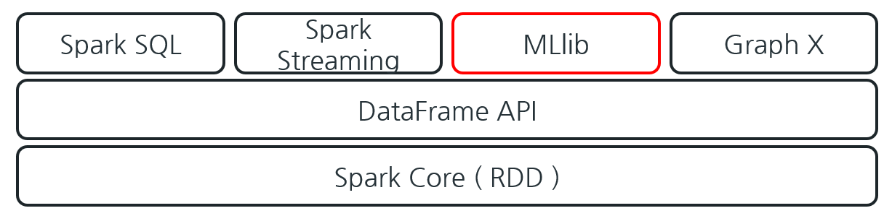

# Spark MLlib (1)

생성 일시: 2025년 8월 6일 오전 9:12

## Machine Learning Library

머신러닝을 쉽고 확장성 있게 적용할 수 있는 라이브러리이다. 데이터 프레임과 연동해 효율적으로 머신러닝 모델을 개발할 수 있다.

## MLLib 으로 할 수 있는 것들

- Feature Engineering
- 통계적인 연산 EDA
- 일반적인 ML 알고리즘(딥러닝 제외)
    - 회귀(Regression): Linear 예측, Logistic 분류 알고리즘이다.
    - Decision Tree, SVM(Support Vector Machine): 분류와 회귀에 모두 사용 가능한 알고리즘이다.
    - Naïve Bayes: 조건부확률 기반 분류로 스팸감지와 텍스트 분류에 효과적이다.
    - 군집 알고리즘: K-Means 클러스터링이다.
    - 추천: Alternating Least Squares 알고리즘이다.
- 파이프라인: 전처리부터 튜닝까지 전체 과정을 지원하며, 필요시 알고리즘을 교체할 수 있다.
- 피처엔지니어링: 데이터에서 필요한 정보를 추출하고 변형하여 인사이트를 찾는 과정이다. 머신러닝 모델이 사용할 데이터를 준비하는 단계이다.
- 유틸스: 선형대수, 통계 등 수학적 공식을 모아놓은 라이브러리이다.

## *머신러닝 파이프라인

- 각 단계를 스테이지라고 한다.
- 데이터 로딩 > 전처리 > 학습 > 평가 스테이지를 연결해 플로우를 만드는 것이 파이프라인
- 모델 평가 결과 모델이 충분한 성능을 발휘하지 못하면?
- 모델평가 이후 하이퍼 파라미터를 진행(튜닝) 한 다음 다시 시도한다.

머신러닝의 파라미터 종류 :

1)모델 파라미터: 머신러닝 알고리즘이 학습,  즉 학습대상

2)하이퍼 파라미터: 사람이 모델에게 넣어주는 알고리즘  > 튜닝대상

### MLlib의 주요 Component들

- DataFrame
- Transformer.transform()
- Data Normalization, Tokenization, Categorical Numeric Encoding, One Hot Encoding 등
- Estimator.fit()
- Evaluator
- BinaryClassificationEvaluator, CrossValidator
- **Pipeline**
    
    
    

# 파이프라인

## **데이터 준비**

- 입력 데이터는 DataFrame 형태로 사용되며, 각 행은 하나의 데이터 포인트, 각 열은 특성(Feature) 또는 레이블(Label)을 나타내는 구조이다.
- 입력 데이터는 일반적으로 CSV, JSON, Parquet, Avro 등의 형식으로 제공되는 파일이다.
- 학습용과 테스트용 데이터 세트를 분리하여 생성하는 과정이다.

 학습/테스트 분할

## **변환기 Transformaer**

- Feature Transformation을 담당한다. 피처 트랜스폼은 보통 하나 이상의 컬럼을 추가하는 작업이다.
- 원본 DataFrame을 머신러닝이 가능한 새로운 DataFrame으로 변환한다.
- 머신러닝 가능 DataFrame은 숫자데이터로 구성된다.
- 문자데이터는 처리가 불가능하므로 전처리를 수행한다.
- 모든 Transformer는 transform() 함수를 가지고 있다.
- 변환기는 데이터를 변환하는 정적인 연산을 수행한다.
- 입력 데이터(DataFrame) → 변환된 데이터(DataFrame).
- 예시 : Data Normalization, Tokenization, Categorical Numeric Encoding, One Hot Encoding 등

- 원핫인코딩(One hot encoding) > 카테고리 형식의 데이터를 피처로 넣을 때 입력한 데이터 중 한 개만 1, 나머지는 0으로 설정한다.
- **StStringIndexer**: 범주형 데이터를 숫자로 변환.
    - **StringIndexer의 주요 역할**
        
        1.**범주형 데이터의 수치화**: StringIndexer는 범주형 변수의 각 고유 값에 숫자를 할당하여 모델링 가능한 수치형 데이터로 변환하는 도구이다. 예를 들어, "red", "blue", "green"과 같은 색상 범주가 있다면, 이들 각각에 0, 1, 2와 같은 숫자를 할당할 수 있다.1.**범주형 데이터의 수치화**: StringIndexer는 범주형 변수의 각 고유 값에 숫자를 할당하여 모델링 가능한 수치형 데이터로 변환하는 도구이다. 예를 들어, "red", "blue", "green"과 같은 색상 범주가 있다면, 이들 각각에 0, 1, 2와 같은 숫자를 할당할 수 있다.
        
        2.**빈도 기반 인덱싱**: 기본적으로 StringIndexer는 가장 빈도가 높은 범주부터 시작하여 순서대로 낮은 숫자를 할당하는 방식이다. 이는 가장 일반적인 범주가 낮은 숫자 인덱스를 받아 일부 모델에서 더 빠른 학습과 예측이 가능하다.2.**빈도 기반 인덱싱**: 기본적으로 StringIndexer는 가장 빈도가 높은 범주부터 시작하여 순서대로 낮은 숫자를 할당하는 방식이다. 이는 가장 일반적인 범주가 낮은 숫자 인덱스를 받아 일부 모델에서 더 빠른 학습과 예측이 가능하다.
        
        3.**모델 입력 준비**: 많은 머신러닝 알고리즘들, 특히 선형 모델과 트리 기반 모델들은 입력 데이터로 숫자형 벡터를 요구한다. StringIndexer를 사용하여 범주형 데이터를 수치형 데이터로 변환함으로써 이러한 요구사항을 충족시킬 수 있다.3.**모델 입력 준비**: 많은 머신러닝 알고리즘들, 특히 선형 모델과 트리 기반 모델들은 입력 데이터로 숫자형 벡터를 요구한다. StringIndexer를 사용하여 범주형 데이터를 수치형 데이터로 변환함으로써 이러한 요구사항을 충족시킬 수 있다.
        
- **VectorAssembler**: 여러 특성을 단일 벡터 컬럼으로 결합.
- **StandardScaler**: 데이터를 정규화하여 스케일 차이를 제거.

## **추정기 Estimator**

- 모델의 학습을 담당하는 역할이다.
- 모든 Estimator는 fit() 함수를 가지고 있다.
- fit()은 DataFrame을 입력 받아 학습한 다음, Model을 반환한다.
- 입력 데이터(DataFrame) → 학습된 모델(Transformer)로 변환된다.
- 모델은 하나의 Transformer라고 볼 수 있다.

## **평가 Evaluator**

- 모델의 성능을 평가 방식(metric)을 기반으로 평가하는 도구이다.
- RMSE, MSE, MAE, Cross Entropy Error 등의 평가 지표가 있다.
- 여러 모델의 성능을 평가하여 최적의 모델을 선택함으로써 모델 튜닝을 자동화할 수 있다.
- BinaryClassificationEvaluator, CrossValidator 등의 평가기가 있다.

## **파이프라인 (Pipeline) 객체**

- 여러 변환기와 추정기를 연결하여 머신러닝 워크플로우를 정의하는 도구이다.
- 여러 stage를 담고 있으며, 머신러닝의 전체적인 워크플로우를 연결시켜 주는 역할이다.
- **Pipeline** 객체는 입력 데이터(DataFrame)를 받아 변환 및 학습을 자동으로 처리하는 객체이다.
- 각 stage마다 담당하는 과정이 있으며, stage는 로딩, 전처리, 학습, 모델 평가 등 각각의 과정들을 담당하는 요소이다.
- 파이프라인을 이용해 Evaluator까지 거치면 모델이 완성되는 구조이다.

